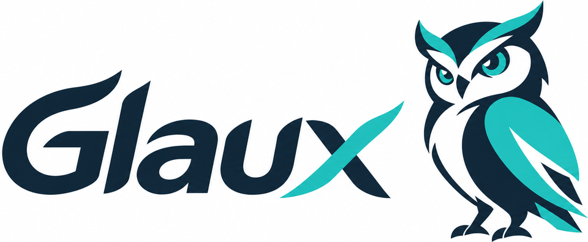

<p align="center"></p>

# Glaux: A Lightweight DAW for Making Music with AI

[日本語](README.md) | English

**A simple, lightweight desktop DAW for making music together with AI** (Rust + Tauri + Svelte 5).
Ask in the chat — "write a 4-bar bassline", "make only the chorus bigger" — and the AI edits the project directly, with changes showing up on the timeline right away.

> [!NOTE]
> This is an experimental personal project, mainly tested on Windows 11 (on Linux only the core and engine are built and tested; macOS is untested).
> Features and the file format may change without notice. The UI and the in-code documentation are in Japanese.

## Features

- **Compose with AI** — Work with Claude (Claude Code) or GPT (Codex CLI). Human and AI edits share one history, and you can undo an AI's whole turn at once
- **The AI can listen** — It measures loudness, frequency balance, key and chords, rhythm and timbre by itself, and checks its work before reporting
- **Instruments and effects** — 7 built-in instruments (subtractive, FM, wavetable, drums, plucked string, sampler, SoundFont), 9 effects (EQ, compressor, reverb, amp, and more), and CLAP plugins (e.g. Surge XT)
- **Write and record** — Piano roll, drum kit, fretboard, MIDI keyboard, audio recording, humming-to-MIDI, stem separation, tempo-following audio clips
- **Designed for AI** — Projects are readable JSON. Every edit goes through the same command API with full undo. Built-in MCP server
- **Play it in games** — A Godot 4 extension plays your songs in-game and syncs enemies or hit judgement to the beat

See [`docs/CAPABILITIES.md`](docs/CAPABILITIES.md) (Japanese) for what the AI can do and which genres it can make.

## Getting started (Windows)

### Use the app

```bat
scripts\build-release.bat
```

This creates `Glaux.exe` (a standalone executable) and an installer in `release\`. The only runtime requirement is WebView2 (included in Windows 10 / 11).

### Run from source

Requirements: [Rust](https://rustup.rs) 1.89+ / [Node.js](https://nodejs.org) LTS

```bat
scripts\glaux-app.bat [C:\path\to\MySong.glaux]
```

### Set up the AI chat

The chat uses a CLI installed and signed in on your PC. Switch between them at the top left of the chat panel.

| Partner | CLI | Setup |
|---|---|---|
| Claude | [Claude Code](https://claude.com/claude-code) | Install and sign in |
| GPT | [Codex CLI](https://github.com/openai/codex) | `npm i -g @openai/codex` → `codex login` |

The AI can only use Glaux's tools — it cannot read or write files on your PC or run commands.

## Connect from an MCP client

While the app is running, an HTTP MCP server listens at `http://127.0.0.1:41920/mcp`.

```bat
claude mcp add --transport http glaux http://127.0.0.1:41920/mcp
```

For Codex, add `[mcp_servers.glaux]` with `url = "http://127.0.0.1:41920/mcp"` to `~/.codex/config.toml`.
To use it without the app, run the stdio server: `scripts\glaux-mcp.bat <song folder>` (the same song can't be open in the app at the same time).

<details>
<summary>Tools (42)</summary>

| Group | Tools |
|---|---|
| Basics | `get_project` `apply_commands` `undo` `redo` `checkpoint` `revert_to` `revert` `get_history` `get_changes` `list_params` `get_guide` |
| Arrangement | `duplicate_clips` `insert_bars` `delete_bars` `bounce_track` |
| Analysis | `analyze_audio` `analyze_harmony` `analyze_rhythm` `analyze_beats` `analyze_sound` `compare_sounds` `match_sound` |
| Notes | `transpose_notes` `shift_notes` `swing_notes` `quantize_notes` `scale_velocity` |
| Sounds | `list_presets` `save_preset` `load_preset` `delete_preset` `find_similar_presets` `list_soundfonts` `set_soundfont_instrument` |
| CLAP | `list_plugins` `list_plugin_presets` `load_plugin_preset` `refine_plugin_params` |
| Audio | `import_sample` `import_audio_clip` `transcribe_audio` `separate_audio` |

</details>

## Use it in Godot 4

The `GlauxPlayer` node plays a `.glaux` song and emits beats, markers and notes as signals, timed to what the player actually hears.
It can also play sound effects in the key and chord of the background music. See [`docs/GODOT.md`](docs/GODOT.md) for building the add-on
and the add-on's [`README`](godot/demo/addons/glaux/README.md) for using it in a game (both in Japanese).

## Structure

```
crates/
  glaux-core    Project model, commands, history, harmony and rhythm analysis
  glaux-mcp     MCP server, session, presets
  glaux-engine  Real-time playback, recording, MIDI input, export, audio analysis
  glaux-dsp     Built-in instruments and effects
  glaux-ml      Model inference (transcription, pitch, beats, timbre)
  glaux-clap    CLAP plugin host
  glaux-godot   Godot 4.3+ extension
app/            Desktop app (Tauri + Svelte 5)
godot/          Godot demo and add-on build
```

Development: `cargo test --workspace` / `cargo clippy --workspace --all-targets`. Docs and comments are in Japanese; the project is developed together with AI (Claude Code).
Planned improvements are listed in [`docs/IMPROVEMENTS.md`](docs/IMPROVEMENTS.md).

## Bundled components and license

The source code and documentation are dual-licensed under **MIT or Apache-2.0** ([LICENSE-MIT](LICENSE-MIT) / [LICENSE-APACHE](LICENSE-APACHE)).

| Component | Distribution | License |
|---|---|---|
| Models (basic-pitch / SwiftF0 / Beat This!) | Bundled ([sources](crates/glaux-ml/models/README.md)) | Apache-2.0 / MIT / MIT |
| Timbre vocabulary (from LAION-CLAP text embeddings) | Bundled | Apache-2.0 |
| LAION-CLAP audio model | Downloaded on first use | Apache-2.0 |
| SoundFonts, CLAP plugins, Demucs | Not bundled (get them yourself) | Their own licenses |
| **Logos and icons** | `assets/` and others | **Not covered by the license above** |

The logos and icons (the Glaux logo, the owl artwork, and images made from them) may only be used to refer to Glaux itself.
Do not modify them or use them as the logo of your own product or fork; if you distribute a fork, give it a different name and logo.
See [`assets/BRAND_GUIDE.md`](assets/BRAND_GUIDE.md) for usage.
